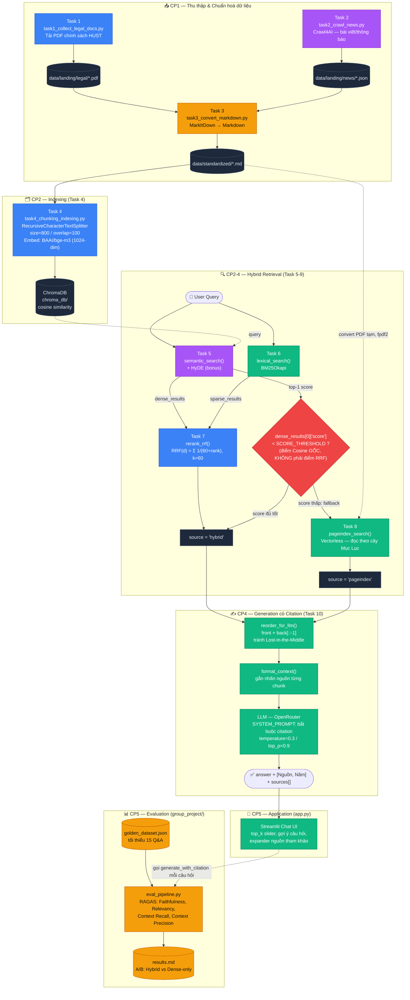

# Kiến Trúc Hệ Thống — RAG Pipeline v2 (HUST)

> Vẽ từ code thật trong `src/*.py` + `app.py` + `group_project/evaluation/*` (không phải sơ đồ mẫu chung chung). Màu block = người phụ trách, khớp `TASK_ASSIGNMENT.md`.

**Chú giải màu (khớp `TASK_ASSIGNMENT.md`):** 🔵 Trung · 🟣 Hiển · 🟢 Đức · 🟡 Sơn · ⬛ Data store · 🔴 Điểm quyết định (fallback)
Khôi (Role 1) không có block riêng — vai trò là duyệt config xuyên toàn bộ pipeline (xem mục 4 bên dưới), không sở hữu 1 stage cụ thể.

---

## 1. Luồng đi từng bước

1. **Thu thập (Task 1-3):** Trung tải PDF chính sách (`data/landing/legal/`), Hiển crawl bài viết/thông báo (`data/landing/news/`), Sơn gộp cả hai qua MarkItDown thành `.md` chuẩn hoá trong `data/standardized/`.
2. **Indexing (Task 4):** Trung cắt `.md` thành chunk 800 ký tự/overlap 100, embed bằng `BAAI/bge-m3` (1024 chiều), lưu vào ChromaDB persistent (`chroma_db/`, không gian cosine).
3. **Truy vấn song song (Task 5+6):** Query chạy đồng thời qua Hiển's `semantic_search()` (dense, cosine trên ChromaDB) và Đức's `lexical_search()` (BM25 trên toàn corpus).
4. **Gộp thứ hạng (Task 7):** Trung's `rerank_rrf()` gộp 2 danh sách theo `RRF(d) = Σ 1/(60+rank)` → không cộng điểm trực tiếp, chỉ dựa thứ hạng.
5. **Quyết định fallback (Task 9, Trung+Hiển phối hợp):** So `dense_results[0]['score']` (cosine gốc, **không phải** điểm RRF ~0.016) với `SCORE_THRESHOLD` Hiển tự đo trên corpus HUST. Thấp → nhảy sang Task 8.
6. **Vectorless fallback (Task 8, Đức):** Khi hybrid không đủ tin cậy, `pageindex_search()` đọc tài liệu theo cấu trúc cây mục lục (không qua chunk) — dùng cho câu hỏi tổng hợp cả chương/mục.
7. **Sinh câu trả lời (Task 10, Đức):** Dù đến từ nhánh nào, kết quả đều qua `reorder_for_llm()` (front + back đảo ngược, chống Lost-in-the-Middle) → `format_context()` gắn nhãn nguồn → gọi LLM qua OpenRouter với `SYSTEM_PROMPT` ép buộc trích dẫn `[Nguồn, Năm]`.
8. **Hiển thị (app.py):** Streamlit render câu trả lời + expander liệt kê từng chunk nguồn kèm score.
9. **Đánh giá (group_project/, Sơn):** `golden_dataset.json` (≥15 câu) chạy qua `generate_with_citation()`, RAGAS đo 4 chỉ số, so sánh A/B (Hybrid+rerank vs Dense-only) → `results.md`.

## 2. 2 nhánh fallback — khi nào đi nhánh nào

| | Hybrid (nhánh chính) | PageIndex (fallback) |
|---|---|---|
| Kích hoạt khi | `dense_results[0].score ≥ SCORE_THRESHOLD` | `dense_results[0].score < SCORE_THRESHOLD` |
| Cơ chế | Semantic + BM25 → RRF | Đọc cấu trúc mục lục, không chunk |
| Phù hợp với | Câu hỏi cụ thể, có từ khoá/khái niệm rõ | Câu hỏi tổng hợp cả tài liệu, hoặc corpus không có đoạn nào thật sự liên quan |
| `source` field | `"hybrid"` | `"pageindex"` |

## 3. Bẫy đã biết (đừng lặp lại)

- **RRF score ≠ độ liên quan.** Top-1 sau RRF luôn ≈ 1/61 ≈ 0.016 bất kể nội dung có khớp câu hỏi hay không — quyết định fallback ở bước 5 phải dùng điểm cosine gốc từ Task 5, tách riêng khỏi điểm dùng để sắp thứ tự cuối cùng.
- **`SCORE_THRESHOLD` không copy nguyên mẫu.** Số 0.48 trong tài liệu gốc đo trên corpus/embedding khác (RMIT) — corpus HUST phải tự đo lại (xem `TASK_ASSIGNMENT.md`, mục Role 3).
- **Đổi corpus phải xoá `chroma_db/` cũ** trước khi index lại, nếu không chunk cũ/mới lẫn lộn.

## 4. Config dùng chung (Khôi duyệt trước mỗi checkpoint)

| Tham số | Giá trị | File |
|---|---|---|
| `CHUNK_SIZE` / `CHUNK_OVERLAP` | 800 / 100 | `src/task4_chunking_indexing.py` |
| `EMBEDDING_MODEL` | `BAAI/bge-m3` (1024-dim) | `src/task4_chunking_indexing.py` |
| RRF `k` | 60 | `src/task7_reranking.py` |
| `SCORE_THRESHOLD` | tự đo trên corpus HUST | `src/task9_retrieval_pipeline.py` |
| `TEMPERATURE` / `TOP_P` | 0.3 / 0.9 | `src/task10_generation.py` |
